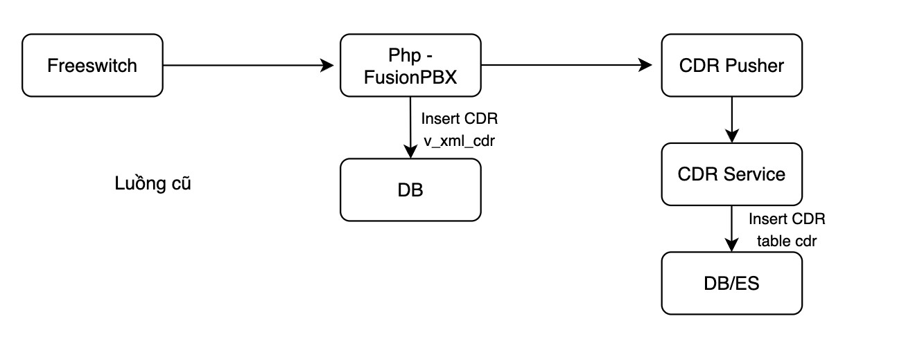
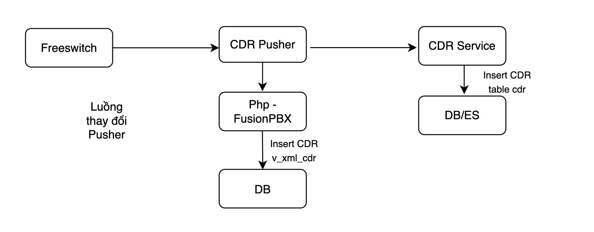
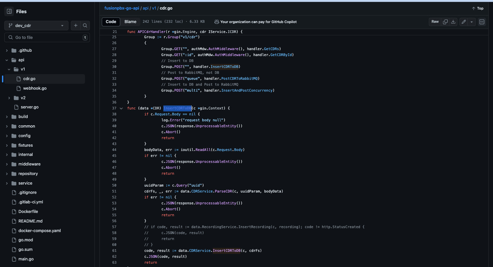
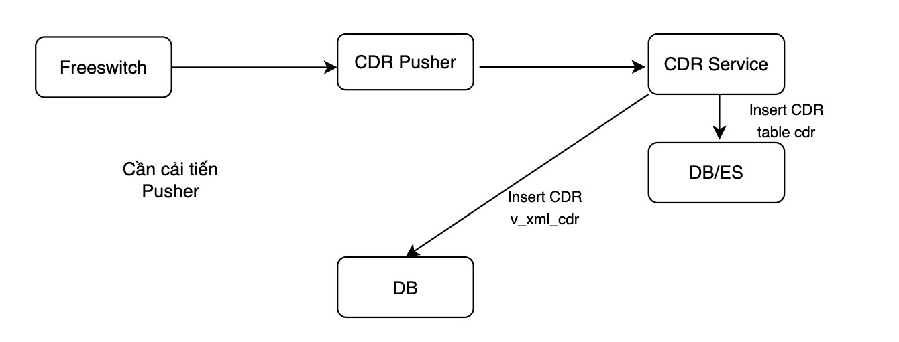

# Điều chỉnh luồng pusher CDR và listen/download recording CCP

## Điều chỉnh luồng pusher CDR
### Trước đó, luồng CDR sẽ hoạt động theo kiểu
- Freeswich sử dụng module XML CDR để post XML vào http server của FusionPBX qua file php /var/www/fusionpbx/app/xml_cdr/v_xml_cdr_import.php
- Trong file php sẽ có các phần parse CDR để insert vào DB table v_xml_cdr của FusionPBX, đồng thời sẽ có 1 funtion PosttoAPI để đẩy qua CDR Pusher
- Khi server bị tải cao thì nginx thường bị timeout nginx, php hoặc 1 số cuộc dài có file XML quá nặng dẫn đến bị mất CDR ở FusionPBX kéo theo bị mất CDR ở CCP

### Hiện tại luồng pusher CDR mới đã tách luồng CDR của CCP và FusionPBX ra riêng 2 hướng riêng biệt
- CDR Service
- Source FusionPBX: /var/www/fusionpbx/app/xml_cdr/v_xml_cdr_import.php

Thì có hiện tượng các file xml được Freeswitch sinh ra ở các cuộc gọi dài, kịch bản phức tạp quá nặng (hơn 3MB, có cuộc 4-5MB) dẫn đến source FusionPBX không parse ra nổi dẫn đến mất CDR ở FusionPBX và không nghe được recording từ CCP, do nó đang móc qua source FusionPBX để nghe và tải recording. Nhưng source FusionPBX thì nó phải quét ở table v_xml_cdr để lấy thông tin file recording dựa vào uuid cuộc gọi đó, tuy nhiên CDR không được insert vào dẫn đến không lấy dc thông tin ghi âm

### Cần cải tiến Pusher CDR
Đầu tiên, điểm khác biệt giữa CDR Service CCP và Source FusionPBX là:
- CDR Service CCP: sử dụng application/xml và truyền nguyên body xml vào đó
- Source FusionPBX: sử dụng form-data với param cdr = "body XML"

Chúng ta cần cải tiến luồng CDR Pusher để không phụ thuộc vào source FusionPBX nữa. Các phần cần cải thiến là:
- Thay đổi luồng pusher từ CDR pusher đẩy vào source FusionPBX thay bằng CDR Pusher vào CDR Service (vẫn giữ riêng biệt 2 luồng pusher for CCP) - tóm tắt là chuyển phần parse,import CDR của FusionPBX từ PHP qua GO
- Điều chỉnh lại CDR Service:
 + Mang phần InsertCDRToDB ở API CDR V1 vào sử dụng

 + Xây dựng model với CDRFs
 + Cho phép cấu hình thời gian lấy file recording ở storage local, ngoài thời gian đó thì lấy ở S3 theo cấu hình (ví dụ: cấu hình 5 ngày thì những CDR dưới 5 ngày sẽ lấy file recording ở local, hơn 5 ngày sẽ lấy ở S3 Storage)

Mục tiêu của việc cải tiến này:
- Đảm bảo cover được CDR ở CDR và CCP
- Không bị mất CDR do có retry và handle được các cuộc gọi dài
- Có thể đẩy manual lại từ file XML đã lưu trước đó nếu bị mất
- Có thể giới hạn được thời gian lưu CDR ở v_xml_cdr xuống 5-7 ngày sau đó clear để đỡ được phần data nặng của FusionPBX - tiết kiệm resource, disk, DB cũng nhanh hơn
- Không còn bị phụ thuộc vào web FusionPBX nữa
- Build up được nơi lưu trữ recording tập trung là S3 Storage